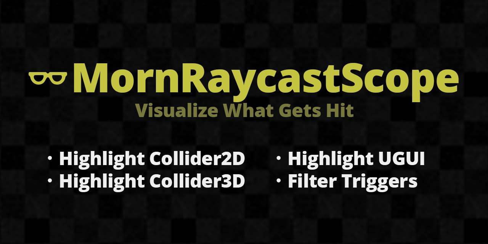

# MornRaycastScope

<p align="center">
  
</p>

<p align="center">
  
</p>

## 概要

MornRaycastScope は、Unity SceneView 上で UGUI RaycastTarget・Collider2D・Collider3D を可視化するエディタツールです。
`Tools > MornRaycastScope` から開けます。

## 導入方法

Unity Package Manager で以下の Git URL を追加:

```
https://github.com/TsukumiStudio/MornRaycastScope.git
```

`Window > Package Manager > + > Add package from git URL...` に貼り付けてください。

## 機能

### UGUI

- **RaycastTarget 可視化** — `raycastTarget = true` の Graphic を塗りつぶし・枠線で表示
- **CanvasGroup 考慮** — `blocksRaycasts = false` 配下の Graphic を除外可能
- **Prefab 編集対応** — Prefab Editing Mode 中のPrefab内も対象

### Collider2D

- **Box / Circle / Capsule / Polygon / Edge** に対応
- **Trigger / 非Trigger フィルタ** — ボタンで切替
- 塗りつぶし・枠線・GameObject名ラベルを表示

### Collider3D

- **Box / Sphere / Capsule / MeshCollider** に対応
- **MeshCollider** はオプションで表示切替（デフォルトOFF）
- Sphere・Capsule はビルボード描画でどの角度でも自然に表示
- Box はカメラ向き面のみ塗りつぶし（半透明の二重乗り防止）

### 共通機能

- **塗りつぶし / 枠線** — 個別ON/OFF（色付きトグルボタン）
- **枠線の太さ** — スライダーで調整
- **ラベル** — 文字表示ON/OFF、フォントサイズ、文字色、背景ON/OFF、背景色
- **深度ソート** — カメラに近いラベルが手前に描画
- **タブ別有効化** — UGUI / 2D / 3D を独立ON/OFF、同時可視化可能
- **EditorPrefs 永続化** — 全設定がUnity再起動後も保持
- **設定リセット** — ワンクリックで全設定を初期値に戻す

## 注意事項

- SceneView 上の描画のみ対応（GameView には表示されません）
- MeshCollider の可視化は頂点数に応じて負荷が増加します

## ライセンス

[The Unlicense](LICENSE)
